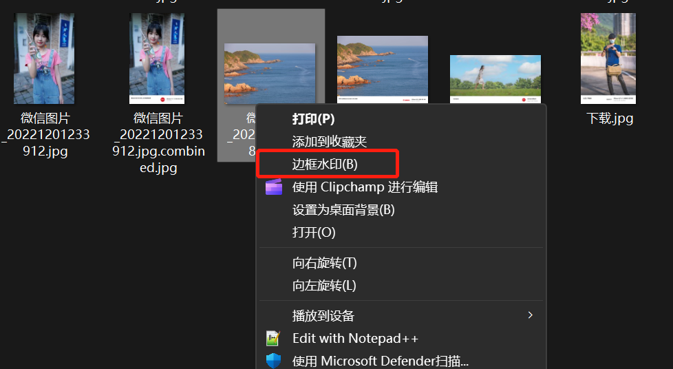

# image-bordering
批量生成加边框图片

## 要求：
1. 安装 node 和 python 环境
2. 执行 npm install

## 功能：
### 1. Windows添加右键菜单 [边框水印]
```python
管理员运行

> python .\Windows\添加到右键菜单.py

```
### 2. Windows删除右键菜单 [边框水印]

```python
管理员运行

> python .\Windows\删除右键菜单.py

```


### 操作：
一次最多选9张图片

